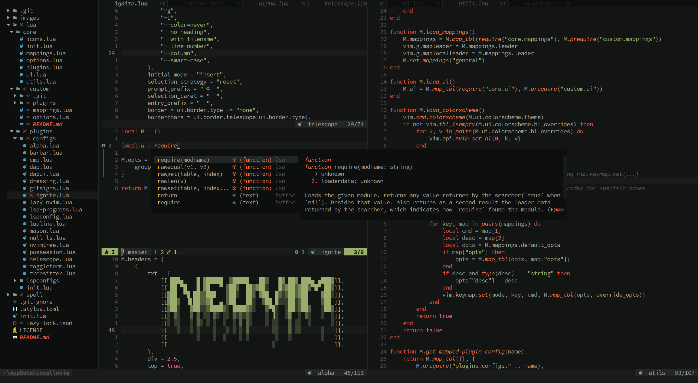

<!-- TODO: Write a better README -->

# Ovim



Is a small Neovim configuration setup to make it easy to customize and extend
with your own configurations

[Here's](https://github.com/Oniup/ovim-config.git) my custom configuration
which can be used as an example.

## Features

*Will spell out eventually*

## Installation

***Linux:***

Very straight forward, just use your favorite package manager to install the 
[dependencies](#Dependencies)

***MacOS:***

To install the required packages listed under [dependencies](#Dependencies),
you'll need Homebrew

***Windows:***

Install the either [Chocolatey](https://chocolatey.org/) or
[Scoop](https://scoop.sh/) to install the listed packages under
[dependencies](#Dependencies)

> Chocolatey requires the terminal to be elevated with admin privileges to
> install anything

### Dependencies

* [Node](https://nodejs.org/en)
  * *NOTE: this cannot be installed through chocolatey. Node also installs
    npm which is also required*
* [NPM](https://www.npmjs.com/) which a large amount of LSP packages require
  through Mason
* [RipGrep](https://github.com/BurntSushi/ripgrep)
* [Python](https://community.chocolatey.org/packages/python/3.11.4) which
  installs pip. A large amount of LSP packages require pip through Mason
* [CMake](https://cmake.org/)
* [LLVM]()
* [FZF](https://github.com/junegunn/fzf) which is used for fuzzy search to
  improve telescope performance

Make sure that pynvim is installed and is the latest version

```bash
pip install pynvim --upgrade
```

> It is recommended to download and use a Nerd Font for displaying icons. However
> it isn't required.

### Clone Repo

***Windows:***

```
git clone https://github.com/Oniup/ovim.git $HOME\AppData\Local\nvim --depth 1
```

***Linux/MacOS:***

```bash
git clone https://github.com/Oniup/ovim.git ~/.config/nvim --depth 1
```

## Uninstall

***On Linux/MacOS:***

```bash
rm -rf ~/.config/nvim
rm -rf ~/.local/share/nvim
```

***On Windows:***

*NOTE: using powershell or pwsh*

```bash
Remove-Item ~\AppData\Local\nvim -Recurse -Force
Remove-Item ~\AppData\Local\nvim-data -Recurse -Force
Remove-item ~\AppData\Local\Temp\nvim -Recurse -Force
```

# License

MIT License, which can be found in the [LICENSE](./LICENSE) file
